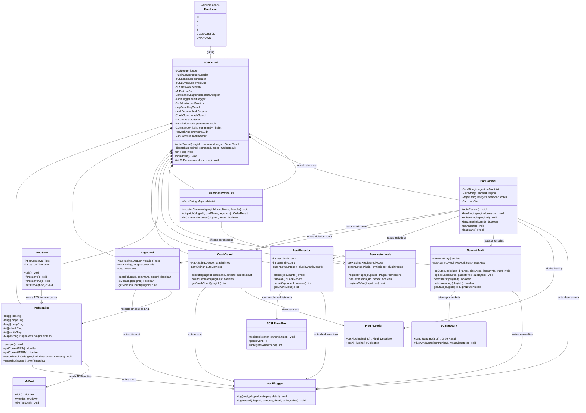
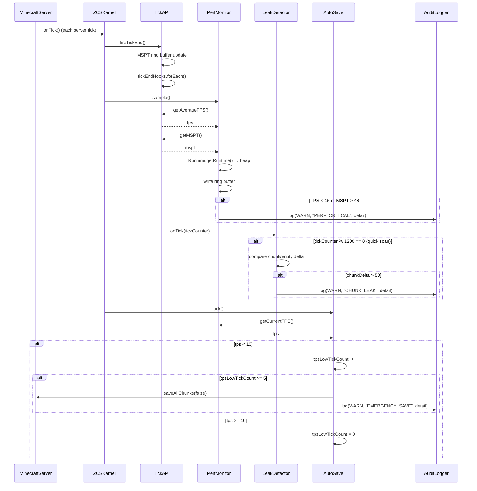
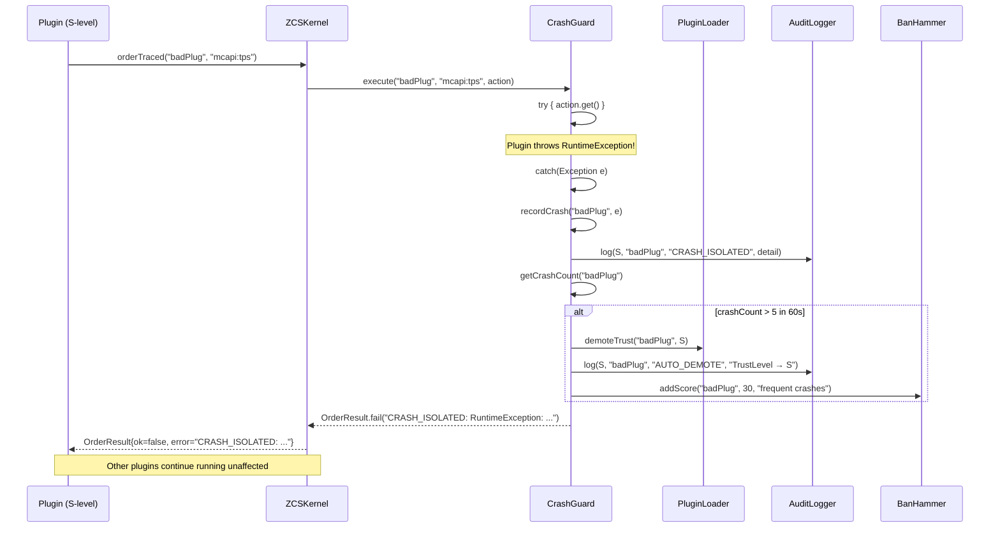
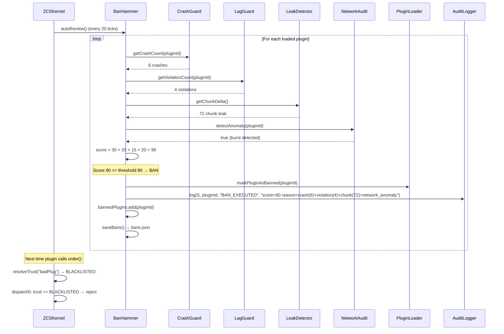

# ZCSLIB P15 + P16 架构设计文档

> **版本**: v1.0 — 基于 ZCSKernel v0.2.0 代码库分析
> **目标**: NeoForge 21.1（兼容 26.1）
> **模块**: monitor/ (P15) + security/ (P16)

---

## 1. 概述

### 1.1 定位

P15 和 P16 是 M6 "MC 深度集成"的最后两个模块，完成从"框架能跑"到"带框架的服能玩"的闭环：

| 模块 | 目标 | 问题 |
|------|------|------|
| **P15 monitor/** | 性能监控 + 自保护 | 单插件崩溃可能带崩服、TPS 不可见、资源泄漏无人发现 |
| **P16 security/** | 安全加固 | TrustLevel 静态不变、无命令白名单、网络流量无审计、恶意插件无自动隔离 |

### 1.2 架构原则

1. **通过 dispatch 路由接入** — 所有 monitor/security 子系统通过 `ZCSKernel.dispatch0()` 统一路由，与现有 mcapi/sandbox 模式一致
2. **kernel-internal** — monitor 类不对外暴露，通过 `ZCSKernel.onTick()` 和 `orderTraced()` 内部集成
3. **信任门控** — security 类严格执行 TrustLevel 检查；新增 `BLACKLISTED` 信任级别表示已被 BanHammer 隔离
4. **线程安全** — PerfMonitor 在 tick 主线程采集，LagGuard 可触发 Thread.interrupt，LeakDetector 读 ConcurrentHashMap
5. **非侵入** — 不强制插件改造，CrashGuard 透明包裹、LagGuard 透明计时

---

## 2. P15 monitor/ — 5 个类详细设计

### 2.1 PerfMonitor.java — 实时性能采集

**职责**: tick-end 采集 TPS/MSPT/JVM heap/chunk 数/实体数，写入环形缓冲，超标时触发审计告警。

**核心字段**:
```java
package zcslib.monitor;

public class PerfMonitor {
    // ── 环形缓冲（最近 300 个采样点 ≈ 15 秒） ──
    private static final int BUFFER_SIZE = 300;
    private final long[] tpsRing       = new long[BUFFER_SIZE];  // TPS × 100
    private final long[] msptRing      = new long[BUFFER_SIZE];  // MSPT × 1e6 (ns)
    private final long[] heapRing      = new long[BUFFER_SIZE];  // heap used bytes
    private final int[]  chunkRing     = new int[BUFFER_SIZE];
    private final int[]  entityRing    = new int[BUFFER_SIZE];
    private int ringIdx, ringCount;

    // ── 当前 tick 快照 ──
    private double currentTPS, currentMSPT;
    private long currentHeapUsed, currentHeapMax;
    private int currentChunks, currentEntities;
    private TickHealth currentHealth;
    private long lastSampleTick;

    // ── 超标阈值与统计 ──
    private double msptWarnThreshold  = 40.0;   // MSPT > 40ms 告警
    private double msptCriticalThreshold = 48.0; // MSPT > 48ms 严重
    private double tpsWarnThreshold   = 18.0;   // TPS < 18 告警
    private double tpsCriticalThreshold = 15.0;

    // 超标计数器（累积，不清零，可通过 /zcslib debug perf 查询）
    private long msptWarnCount, msptCriticalCount;
    private long tpsWarnCount, tpsCriticalCount;

    // ── 插件级性能 ──
    private final Map<String, PluginPerf> pluginPerfMap = new ConcurrentHashMap<>();

    // ── 依赖 ──
    private final TickAPI tickAPI;
    private final ZCSLogger logger;
    private final AuditLogger audit;

    public record PluginPerf(
        double avgLatencyMs,    // 平均 order() 耗时
        int timeoutCount,       // LagGuard 触发次数
        int errorCount,         // order() FAIL 次数
        long orderCount,        // 总调用次数
        long lastActivityTick   // 最后活跃 tick
    ) {}
}
```

**方法签名**:
```java
// —— 构造 ——
public PerfMonitor(TickAPI tickAPI, ZCSLogger logger, AuditLogger audit)

// —— tick-end 采集（由 ZCSKernel.onTick() 调用） ——
public void sample()  // 从 TickAPI + Runtime 采集当前快照，写入环形缓冲

// —— 只读查询 ——
public double getCurrentTPS()
public double getCurrentMSPT()
public long   getCurrentHeapUsedMB()
public long   getCurrentHeapMaxMB()
public int    getCurrentChunks()
public int    getCurrentEntities()
public TickHealth getCurrentHealth()

// —— 超标告警查询 ——
public long getMsptWarnCount()
public long getMsptCriticalCount()
public long getTpsWarnCount()
public long getTpsCriticalCount()

// —— 插件级性能 ——
public void   recordPluginOrder(String pluginId, long durationMs, boolean success)
public PluginPerf getPluginPerf(String pluginId)
public Map<String, PluginPerf> getAllPluginPerf()

// —— 快照导出 ——
public PerfSnapshot snapshot(String reason)  // 全量导出当前缓冲 + 统计
```

**与现有系统交互点**:
- `TickAPI.tickEndHooks` — 注册 `sample()` 为 tick-end hook
- `ZCSKernel.orderTraced()` — 调用 `recordPluginOrder()` 记录每次 order 耗时
- `AuditLogger` — MSPT > 48ms 或 TPS < 15 时写入 WARN 级别审计

---

### 2.2 LagGuard.java — 插件超时中断

**职责**: 包装 `orderTraced()`，对每个插件调用设置 50ms 超时上限，超时则 `Thread.interrupt()` + 审计记录。

**核心字段**:
```java
package zcslib.monitor;

public class LagGuard {
    private static final long DEFAULT_TIMEOUT_MS = 50;  // 默认超时
    private final long timeoutMs;

    // ── 违规追踪（滑动窗口 60s） ──
    private final Map<String, Deque<Long>> violationTimes = new ConcurrentHashMap<>();
    private static final int MAX_VIOLATIONS = 3;
    private static final long VIOLATION_WINDOW_MS = 60_000;

    // ── 当前正在执行的调用（pluginId → 开始时间） ──
    private final Map<String, Long> activeCalls = new ConcurrentHashMap<>();

    // ── 依赖 ──
    private final AuditLogger audit;
}
```

**方法签名**:
```java
// —— 构造 ——
public LagGuard(AuditLogger audit)
public LagGuard(AuditLogger audit, long timeoutMs)

// —— 调用包装（由 ZCSKernel.orderTraced() 内部使用） ——
// 返回 true = 正常完成，false = 超时被中断
public boolean guard(String pluginId, String command, Runnable action)

// —— 违规查询 ——
public boolean isViolating(String pluginId)  // 60s 内 > 3 次超时
public int    getViolationCount(String pluginId)
public void   resetViolations(String pluginId)
```

**超时实现策略**:
```java
// 方案 A（推荐，不依赖 Future）：watchdog 线程 + Thread.interrupt
// 在 guard() 中：
//   1. 记录 startTime
//   2. 启一个 daemon watchdog 线程，sleep(timeoutMs) 后检查
//   3. 如果 action 还没结束 → 调用执行线程.interrupt()
//   4. 审计记录 "LAG_TIMEOUT: plugin=xx cmd=xx timeout=50ms"

// 方案 B（备选）：CompletableFuture.orTimeout() — 需要 action 响应中断
```

**与现有系统交互点**:
- `ZCSKernel.orderTraced()` — 内部调用 `lagGuard.guard(pluginId, command, () -> order(pluginId, command, args))`
- `AuditLogger` — 超时时写入 S 级别审计
- `PerfMonitor.recordPluginOrder()` — 超时也算一次 FAIL 调用

---

### 2.3 LeakDetector.java — 资源泄漏检测

**职责**: tick-end 扫描 listener 泄漏 + chunk 滞留计数，每 5 分钟运行一次完整扫描。

**核心字段**:
```java
package zcslib.monitor;

public class LeakDetector {
    // ── 基线 ──
    private int lastChunkCount;
    private int lastEntityCount;
    private long lastScanTick;

    // ── 趋势追踪 ──
    private final Map<String, Integer> pluginChunkContrib = new ConcurrentHashMap<>();
    // pluginId → 该插件注册的 block change 次数（从 AutoRollback 日志推算）

    // ── 扫描间隔 ──
    private static final long FULL_SCAN_INTERVAL_TICKS = 6000; // 5 min @ 20 TPS
    private static final long QUICK_SCAN_INTERVAL_TICKS = 1200; // 1 min

    // ── 泄漏阈值 ──
    private static final int CHUNK_LEAK_THRESHOLD = 50;  // chunk 数增加 > 50 告警
    private static final int ENTITY_LEAK_THRESHOLD = 200;

    // ── 依赖 ──
    private final ZCSLEventBus eventBus;
    private final TickAPI tickAPI;
    private final WorldAPI worldAPI;
    private final ZCSLogger logger;
    private final AuditLogger audit;

    public record LeakReport(
        int chunkDelta,           // 与上次扫描的 chunk 差值
        int entityDelta,
        int orphanedListeners,    // 插件已卸载但 listener 未注销
        List<String> warnings     // 人类可读的告警
    ) {}
}
```

**方法签名**:
```java
// —— 构造 ——
public LeakDetector(ZCSLEventBus eventBus, TickAPI tickAPI,
                    WorldAPI worldAPI, ZCSLogger logger, AuditLogger audit)

// —— tick 钩子（由 ZCSKernel.onTick() 调用） ——
public void onTick(long tickCounter)

// —— 手动触发（由 /zcslib debug leak 命令） ——
public LeakReport fullScan()

// —— listener 泄漏检测 ——
public int detectOrphanedListeners()  // 遍历 ZCSLEventBus，找 pluginId 不在 PluginLoader 的

// —— chunk 泄漏趋势 ——
public int getChunkDelta()
public int getEntityDelta()
```

**检测逻辑**:
1. **listener 泄漏**: 遍历 `eventBus.listenerToEvents`，对每个 listener 反向查 `PluginLoader.getPlugin(ownerId)` → 如果返回 null 则告警（插件已卸载但 listener 残留）
2. **chunk 滞留**: 对比 `worldAPI.getLoadedChunkCount()` 与上次基线，差值 > 50 告警
3. **趋势**: 连续 3 次快速扫描 chunk 都上升 → WARN 级别审计

**与现有系统交互点**:
- `ZCSLEventBus.listenerToEvents` — 读取 listener 注册表
- `PluginLoader.getPlugin()` — 验证 listener 所属插件是否存活
- `WorldAPI.getLoadedChunkCount()` — 通过 McPort 获取 chunk 数
- `AutoRollback.pendingCount()` — 辅助判断是否有未回滚的写入

---

### 2.4 CrashGuard.java — 插件崩溃隔离

**职责**: 单插件 try-catch 隔离，崩溃后自动降级为 S，审计记录，不中断其他插件。

**核心字段**:
```java
package zcslib.monitor;

public class CrashGuard {
    // ── 崩溃计数（滑动窗口 60s） ──
    private final Map<String, Deque<Long>> crashTimes = new ConcurrentHashMap<>();
    private static final int MAX_CRASHES_PER_WINDOW = 5;
    private static final long CRASH_WINDOW_MS = 60_000;

    // ── 自动降级记录 ──
    private final Set<String> autoDemoted = ConcurrentHashMap.newKeySet();
    // pluginId → 已被 CrashGuard 自动降为 S 的插件

    // ── 依赖 ──
    private final AuditLogger audit;
    private final ZCSLogger logger;
    private final PluginLoader pluginLoader;  // 用于修改 TrustLevel

    public record CrashInfo(
        String pluginId,
        String command,
        String exceptionType,
        String message,
        long tickCounter,
        long timestamp
    ) {}
}
```

**方法签名**:
```java
// —— 构造 ——
public CrashGuard(AuditLogger audit, ZCSLogger logger,
                  PluginLoader pluginLoader)

// —— 执行包装（由 ZCSKernel.dispatch0() 内部使用） ——
// 把单个插件的 order() 包裹在 try-catch 中
public OrderResult execute(String pluginId, String command,
                           Supplier<OrderResult> action)

// —— 崩溃查询 ——
public boolean isAutoDemoted(String pluginId)
public int     getCrashCount(String pluginId)  // 60s 窗口内
public List<CrashInfo> getRecentCrashes(int n)

// —— 手动恢复（/zcslib unban 命令） ——
public void resetDemotion(String pluginId)
```

**隔离逻辑**:
```java
public OrderResult execute(String pluginId, String command,
                           Supplier<OrderResult> action) {
    try {
        return action.get();
    } catch (ThreadDeath | OutOfMemoryError e) {
        // 不可恢复 — 让它传播
        throw e;
    } catch (Exception e) {
        // 记录崩溃
        recordCrash(pluginId, command, e);
        // 60s 内 > MAX_CRASHES_PER_WINDOW → 自动降为 S
        if (getCrashCount(pluginId) > MAX_CRASHES_PER_WINDOW) {
            autoDemote(pluginId);
        }
        return OrderResult.fail("CRASH_ISOLATED: " + e.getClass().getSimpleName()
                                + ": " + e.getMessage());
    }
}
```

**与现有系统交互点**:
- `ZCSKernel.dispatch0()` — 对每个插件的 action 用 CrashGuard 包裹
- `PluginLoader` — 自动降级时修改 PluginDescriptor 的 TrustLevel（如果不可变，则通过 PluginLoader 提供专门的 demote API）
- `AuditLogger` — 崩溃写入 S 级别审计
- `BanHammer` — 崩溃次数可以作为 BanHammer 评分输入

---

### 2.5 AutoSave.java — 定时/紧急世界存档

**职责**: 定时 world save + 崩溃前紧急 forceSaveAll()。

**核心字段**:
```java
package zcslib.monitor;

public class AutoSave {
    private int saveIntervalTicks = 6000;  // 默认 5 分钟
    private int tickCounter;
    private long lastSaveTimestamp;

    // ── 紧急存盘检测 ──
    private int tpsLowTickCount;           // 连续低 TPS tick 计数
    private static final int TPS_EMERGENCY_THRESHOLD = 10;
    private static final int EMERGENCY_TICKS = 5;  // 连续 5 tick < 10 TPS → 紧急存盘
    private boolean emergencySaved;

    // ── 依赖 ──
    private final MinecraftServer server;  // 用于 saveAllChunks()
    private final PerfMonitor perfMonitor;
    private final AuditLogger audit;
    private final ZCSLogger logger;
}
```

**方法签名**:
```java
// —— 构造 ——
public AutoSave(MinecraftServer server, PerfMonitor perfMonitor,
                AuditLogger audit, ZCSLogger logger)

// —— tick 钩子（由 ZCSKernel.onTick() 调用） ——
public void tick()

// —— 配置 ——
public void setInterval(int ticks)
public int  getInterval()

// —— 手动触发（命令 + shutdown hook） ——
public void forceSave()      // forceSaveAll() + flush audit
public void forceSaveAll()   // 遍历所有维度 saveAllChunks()

// —— 状态 ——
public long getLastSaveTimestamp()
public boolean isEmergencySaved()
```

**逻辑**:
```
tick():
  1. tickCounter++
  2. 检查 TPS < TPS_EMERGENCY_THRESHOLD
     → tpsLowTickCount++
     → 如果 >= EMERGENCY_TICKS → forceSave() + emergencySaved = true
  3. 如果 TPS >= TPS_EMERGENCY_THRESHOLD → tpsLowTickCount = 0
  4. 定期存档: tickCounter % saveIntervalTicks == 0 → server.saveAllChunks(false)
```

**与现有系统交互点**:
- `MinecraftServer.saveAllChunks()` — MC 原生存盘 API
- `PerfMonitor.getCurrentTPS()` — 检测紧急存盘触发条件
- `ZCSKernel.shutdown()` — shutdown 时调用 `forceSave()`
- `AuditLogger.flushAll()` — 存盘前刷新审计日志

---

## 3. P16 security/ — 4 个类详细设计

### 3.1 PermissionNode.java — 插件权限节点注册表

**职责**: 为每个插件自动生成 MC PermissionAPI 节点，映射到命令、网络、控制台权限。

**核心字段**:
```java
package zcslib.security;

public class PermissionNode {
    // ── 权限节点常量 ──
    public static final String ROOT        = "zcslib.plugin";
    public static final String OPERATOR    = "zcslib.operator";  // op 2+

    // ── 注册表 ──
    private final Set<String> registeredNodes = ConcurrentHashMap.newKeySet();

    // ── 插件节点映射 ──
    // pluginId → 该插件的权限集
    private final Map<String, PluginPermissions> pluginPerms = new ConcurrentHashMap<>();

    public record PluginPermissions(
        String base,       // zcslib.plugin.<id>
        String network,    // zcslib.plugin.<id>.network
        String command,    // zcslib.plugin.<id>.command
        String console     // zcslib.plugin.<id>.console
    ) {}
}
```

**方法签名**:
```java
// —— 构造 ——
public PermissionNode()

// —— 注册（插件加载时由 ZCSKernel 调用） ——
public PluginPermissions registerPlugin(String pluginId)

// —— 注销（插件卸载时） ——
public void unregisterPlugin(String pluginId)

// —— 查询 ——
public boolean hasPermission(CommandSourceStack src, String node)
public boolean hasPluginPermission(CommandSourceStack src, String pluginId, String action)
public PluginPermissions getPluginPermissions(String pluginId)
public Set<String> getAllNodes()

// —— MC PermissionAPI 注册 ——
// 在 ServerStartedEvent 中调用，向 MC 权限系统注册所有节点
public void registerToMc(CommandDispatcher<CommandSourceStack> dispatcher)
```

**权限映射**:
| 节点 | 含义 | 要求 |
|------|------|------|
| `zcslib.plugin.<id>` | 插件基础权限 | op 2+ |
| `zcslib.plugin.<id>.network` | 允许发网络包 | N/R/A only |
| `zcslib.plugin.<id>.command` | 允许 /zcslib run | op 2+ |
| `zcslib.plugin.<id>.console` | 允许控制台输出 | 自动 |
| `zcslib.operator` | ZCSLIB 管理操作 | op 4 |

**与现有系统交互点**:
- `PluginLoader.scanAndLoad()` — 加载插件时调用 `registerPlugin(pluginId)`
- `CommandAdapter` — 命令执行前检查 `zcslib.plugin.<id>.command`
- `ZCSNetwork` — 网络调用前检查 `zcslib.plugin.<id>.network`
- MC Brigadier CommandDispatcher — 注册权限节点到 MC 系统

---

### 3.2 CommandWhitelist.java — 插件命令白名单

**职责**: 扩展 CommandAdapter，允许插件通过 `/zcslib run <plugin> <cmd>` 暴露命令。

**核心字段**:
```java
package zcslib.security;

public class CommandWhitelist {
    // ── 白名单注册表 ──
    // pluginId → (commandName → handler)
    private final Map<String, Map<String, CommandHandler>> whitelist = new ConcurrentHashMap<>();

    // ── 依赖 ──
    private final ZCSKernel kernel;

    @FunctionalInterface
    public interface CommandHandler {
        OrderResult execute(String[] args, CommandSourceStack src);
    }
}
```

**方法签名**:
```java
// —— 构造 ——
public CommandWhitelist(ZCSKernel kernel)

// —— 白名单管理（插件通过 kernel.order("security:cmd-register") 调用） ——
public void registerCommand(String pluginId, String cmdName, CommandHandler handler)
public void unregisterCommand(String pluginId, String cmdName)
public void unregisterAll(String pluginId)

// —— 调度（由 CommandAdapter 在 /zcslib run 中调用） ——
public OrderResult dispatch(String pluginId, String cmdName,
                            String[] args, CommandSourceStack src)

// —— 查询 ——
public Set<String> getPluginCommands(String pluginId)
public Map<String, Set<String>> getAllWhitelists()  // 用于 /zcslib debug cmds

// —— 信任门控 ——
public boolean isCommandAllowed(String pluginId, TrustLevel trust)
```

**/zcslib run 命令格式**:
```
/zcslib run <pluginId> <command> [args...]

示例:
  /zcslib run MyPlugin status
  /zcslib run MyPlugin reload-config --force
```

**与现有系统交互点**:
- `CommandAdapter.registerRoot()` — 新增 `/zcslib run` 子命令，内部调用 `CommandWhitelist.dispatch()`
- `ZCSKernel.dispatch0()` — 新增 `security:cmd-register` / `security:cmd-unregister` 路由
- `PermissionNode` — `/zcslib run` 前检查 `zcslib.plugin.<id>.command`

---

### 3.3 NetworkAudit.java — 网络包审计

**职责**: 拦截 ZCSNetwork 每个出/入包，记录 IP/插件/大小/耗时，检测突发流量和大载荷。

**核心字段**:
```java
package zcslib.security;

public class NetworkAudit {
    // ── 环形审计缓冲 ──
    private static final int MAX_ENTRIES = 500;
    private final NetworkEntry[] entries = new NetworkEntry[MAX_ENTRIES];
    private int entryIdx, entryCount;

    // ── 插件流量统计 ──
    private final Map<String, PluginNetworkStats> statsMap = new ConcurrentHashMap<>();

    // ── 突发检测 ──
    private static final int BURST_THRESHOLD = 10;     // 10 包/秒
    private static final long BURST_WINDOW_MS = 1000;
    private static final int LARGE_PAYLOAD_BYTES = 1024 * 1024; // 1 MB

    // ── 依赖 ──
    private final AuditLogger audit;

    public record NetworkEntry(
        Direction direction,     // OUTBOUND / INBOUND
        String pluginId,
        String target,           // URL 或 IP
        int sizeBytes,
        long latencyMs,
        long timestamp,
        TrustLevel trust
    ) {}

    public enum Direction { OUTBOUND, INBOUND }

    public record PluginNetworkStats(
        long totalBytesOut,
        long totalBytesIn,
        int requestCount,
        long lastRequestTime,
        int burstCount          // BURST_WINDOW_MS 内的请求数
    ) {}
}
```

**方法签名**:
```java
// —— 构造 ——
public NetworkAudit(AuditLogger audit)

// —— 记录（由 ZCSNetwork 在每个请求前后调用） ——
public void logOutbound(String pluginId, String target,
                        int sizeBytes, long latencyMs, TrustLevel trust)
public void logInbound(String source, String packetType, int sizeBytes)

// —— 检测 ——
public boolean detectBurst(String pluginId)      // 1s 内 > 10 次
public boolean detectLargePayload(String pluginId) // 单包 > 1 MB
public boolean detectAnomaly(String pluginId)     // burst + large payload

// —— 统计查询 ——
public PluginNetworkStats getStats(String pluginId)
public Map<String, PluginNetworkStats> getAllStats()
public List<NetworkEntry> getRecent(int n)
```

**与现有系统交互点**:
- `ZCSNetwork.sendStandard()` — 在 HTTP 请求前后插入 `logOutbound()` 调用
- `ZCSNetwork.flushAndSend()` — 主包发送时记录
- `BanHammer` — `detectAnomaly()` 结果作为评分输入
- `AuditLogger` — 检测到异常时写入审计

---

### 3.4 BanHammer.java — 自动隔离引擎

**职责**: 签名黑名单 + 行为评分 + 自动隔离 S → BLACKLISTED。综合 5 条规则判断是否需要 ban。

**核心字段**:
```java
package zcslib.security;

public class BanHammer {
    // ── 黑名单 ──
    private final Set<String> signatureBlacklist = ConcurrentHashMap.newKeySet();
    private final Set<String> bannedPlugins      = ConcurrentHashMap.newKeySet();
    private final Map<String, String> banReasons  = new ConcurrentHashMap<>();

    // ── 行为评分（每个插件 0-100，越高越危险） ──
    private final Map<String, Integer> behaviorScores = new ConcurrentHashMap<>();
    private static final int BAN_THRESHOLD = 80;

    // ── 评分规则权重 ──
    private static final int SCORE_CRASH_FREQUENT   = 30;  // >5 crash/60s
    private static final int SCORE_VIOLATION_REPEAT  = 25;  // 3+ violation 连续
    private static final int SCORE_CHUNK_LEAK        = 15;  // >50 chunk 泄漏
    private static final int SCORE_NETWORK_ANOMALY   = 20;  // burst + large payload
    private static final int SCORE_DREAMWORKER_FLAG  = 35;  // DreamWorker 标记

    // ── Ban 持久化 ──
    private final Path banFile;  // config/DLZstudio/ZCSLIB/security/bans.json

    // ── 依赖 ──
    private final CrashGuard crashGuard;
    private final LagGuard lagGuard;
    private final LeakDetector leakDetector;
    private final NetworkAudit networkAudit;
    private final AuditLogger audit;
    private final PluginLoader pluginLoader;
    private final ZCSLogger logger;
}
```

**方法签名**:
```java
// —— 构造 ——
public BanHammer(CrashGuard crashGuard, LagGuard lagGuard,
                 LeakDetector leakDetector, NetworkAudit networkAudit,
                 AuditLogger audit, PluginLoader pluginLoader,
                 ZCSLogger logger, Path zcsRoot)

// —— 自动评审（每 tick 或每 20 tick 调用一次） ——
public void autoReview()

// —— 评分 ——
public int  getBehaviorScore(String pluginId)
public void addScore(String pluginId, int points, String reason)

// —— Ban/Unban ——
public void banPlugin(String pluginId, String reason)
public void unbanPlugin(String pluginId)

// —— 查询 ——
public boolean isBanned(String pluginId)
public String  getBanReason(String pluginId)
public Set<String> getBannedPlugins()

// —— 签名黑名单 ——
public void addSignatureToBlacklist(String signature)
public boolean isSignatureBlacklisted(String signature)

// —— 持久化 ——
public void saveBans()   // 写 bans.json
public void loadBans()   // 读 bans.json
```

**autoReview() 5 条件逻辑**:
```
autoReview():
  for each loaded plugin:
    score = 0

    // 条件 1: 频繁崩溃
    if crashGuard.getCrashCount(pluginId) > 5 → score += SCORE_CRASH_FREQUENT

    // 条件 2: 连续违规
    if lagGuard.getViolationCount(pluginId) >= 3 → score += SCORE_VIOLATION_REPEAT

    // 条件 3: chunk 泄漏
    if leakDetector.getChunkDelta() > 50 → score += SCORE_CHUNK_LEAK

    // 条件 4: 网络异常
    if networkAudit.detectAnomaly(pluginId) → score += SCORE_NETWORK_ANOMALY

    // 条件 5: DreamWorker 标记
    if isDreamWorkerFlagged(pluginId) → score += SCORE_DREAMWORKER_FLAG

    behaviorScores.put(pluginId, score)

    if score >= BAN_THRESHOLD → banPlugin(pluginId, buildReason(pluginId, score))
```

**banPlugin() 效果**:
1. 将插件 TrustLevel 改为 `BLACKLISTED`（新增枚举值）
2. 写入 `bans.json` 持久化
3. ZCSKernel 在 dispatch0 中拒绝 BLACKLISTED 插件的所有 order()
4. PluginLoader 下次扫描时跳过被 ban 的 JAR
5. 审计记录 "BAN_EXECUTED: plugin=xx score=xx reason=xx"

**与现有系统交互点**:
- `CrashGuard` — 读取崩溃计数
- `LagGuard` — 读取违规计数
- `LeakDetector` — 读取泄漏报告
- `NetworkAudit` — 读取异常标志
- `PluginLoader` — ban 后阻止加载
- `ZCSKernel.dispatch0()` — BLACKLISTED 拒绝
- `TrustLevel` — 新增 `BLACKLISTED` 枚举值

---

## 4. 精确文件列表

```
ZCSLIB/src/main/java/zcslib/
├── kernel/
│   └── ZCSKernel.java          # [修改] 新增 dispatch 路由 + monitor/security 字段
├── api/
│   └── TrustLevel.java          # [修改] 新增 BLACKLISTED 枚举值
├── monitor/                     # [新增] P15 全部
│   ├── PerfMonitor.java
│   ├── LagGuard.java
│   ├── LeakDetector.java
│   ├── CrashGuard.java
│   └── AutoSave.java
├── security/                    # [新增] P16 全部
│   ├── PermissionNode.java
│   ├── CommandWhitelist.java
│   ├── NetworkAudit.java
│   └── BanHammer.java
├── mcapi/
│   └── CommandAdapter.java      # [修改] 新增 /zcslib run + /zcslib debug perf/leak
└── network/
    └── ZCSNetwork.java           # [修改] 插入 NetworkAudit 钩子
```

---

## 5. Mermaid 类图



---

## 6. 时序图

### 6.1 Tick 监控采集 (PerfMonitor + LeakDetector + AutoSave)



### 6.2 插件崩溃隔离 (CrashGuard)



### 6.3 BanHammer 自动隔离



---

## 7. 任务列表

| Task ID | 任务名称 | 包含文件 | 依赖 | 优先级 | 预计工时 |
|---------|---------|---------|------|--------|---------|
| **T01** | 基础设施：TrustLevel 扩展 + ZCSKernel 骨架 | `api/TrustLevel.java` (+BLACKLISTED), `kernel/ZCSKernel.java` (新增字段+构造+dispatch路由骨架+getter), `monitor/PerfMonitor.java`, `monitor/LagGuard.java`, `monitor/LeakDetector.java`, `monitor/CrashGuard.java`, `monitor/AutoSave.java` (全部 5 个 monitor 类 stubs), `security/PermissionNode.java`, `security/CommandWhitelist.java`, `security/NetworkAudit.java`, `security/BanHammer.java` (全部 4 个 security 类 stubs) | — | P0 | 2h |
| **T02** | P15 核心：PerfMonitor + LagGuard + CrashGuard 完整实现 | `monitor/PerfMonitor.java`, `monitor/LagGuard.java`, `monitor/CrashGuard.java`, `kernel/ZCSKernel.java` (修改 orderTraced + dispatch0 集成), `mcapi/TickAPI.java` (注册 PerfMonitor hook) | T01 | P0 | 3h |
| **T03** | P15 辅助：LeakDetector + AutoSave 完整实现 | `monitor/LeakDetector.java`, `monitor/AutoSave.java`, `kernel/ZCSKernel.java` (修改 onTick + shutdown) | T01 | P0 | 2h |
| **T04** | P16 安全：PermissionNode + CommandWhitelist + CommandAdapter 扩展 | `security/PermissionNode.java`, `security/CommandWhitelist.java`, `mcapi/CommandAdapter.java` (新增 /zcslib run + debug perf/leak 命令), `kernel/ZCSKernel.java` (新增 security: dispatch) | T01 | P1 | 2.5h |
| **T05** | P16 安全：NetworkAudit + BanHammer + ZCSNetwork 集成 | `security/NetworkAudit.java`, `security/BanHammer.java`, `network/ZCSNetwork.java` (插入 NetworkAudit 钩子), `kernel/ZCSKernel.java` (dispatch 收尾 + BanHammer 集成) | T04 | P1 | 2.5h |

**总计**: 5 个任务, ~12 工时

---

## 8. ZCSKernel.java 变更清单

### 8.1 新增 import

```java
import zcslib.monitor.PerfMonitor;
import zcslib.monitor.LagGuard;
import zcslib.monitor.LeakDetector;
import zcslib.monitor.CrashGuard;
import zcslib.monitor.AutoSave;
import zcslib.security.PermissionNode;
import zcslib.security.CommandWhitelist;
import zcslib.security.NetworkAudit;
import zcslib.security.BanHammer;
```

### 8.2 新增字段（在 `// ── M6: MC integration ──` 区域之后）

```java
// ── P15: Monitor ──────────────────────────────────────
private PerfMonitor perfMonitor;
private LagGuard lagGuard;
private LeakDetector leakDetector;
private CrashGuard crashGuard;
private AutoSave autoSave;

// ── P16: Security ─────────────────────────────────────
private PermissionNode permissionNode;
private CommandWhitelist commandWhitelist;
private NetworkAudit networkAudit;
private BanHammer banHammer;
```

### 8.3 构造器新增初始化（在 `initMcPort` 调用之前）

```java
// ── P15: Init monitor subsystem ──────────────────────
this.perfMonitor = new PerfMonitor(null, logger, auditLogger); // TickAPI 在 McPort 初始化后注入
this.lagGuard = new LagGuard(auditLogger);
this.leakDetector = new LeakDetector(eventBus, null, null, logger, auditLogger);
this.crashGuard = new CrashGuard(auditLogger, logger, pluginLoader);
this.autoSave = new AutoSave(null, perfMonitor, auditLogger, logger);

// ── P16: Init security subsystem ─────────────────────
this.permissionNode = new PermissionNode();
this.commandWhitelist = new CommandWhitelist(this);
this.networkAudit = new NetworkAudit(auditLogger);
this.banHammer = new BanHammer(crashGuard, lagGuard, leakDetector,
        networkAudit, auditLogger, pluginLoader, logger, zcsRoot);
banHammer.loadBans();
```

### 8.4 `initMcPort()` 修改：注入依赖

```java
public void initMcPort(MinecraftServer server, CommandDispatcher<...> dispatcher) {
    // ... 现有逻辑 ...
    // P15: Wire TickAPI into PerfMonitor + LeakDetector
    this.perfMonitor = new PerfMonitor(mcPort.tick(), logger, auditLogger);
    this.leakDetector = new LeakDetector(eventBus, mcPort.tick(), mcPort.world(), logger, auditLogger);
    this.autoSave = new AutoSave(server, perfMonitor, auditLogger, logger);
    // P16: Register permissions to MC
    this.permissionNode.registerToMc(dispatcher);
    // Register plugin permissions for all loaded plugins
    for (PluginDescriptor pd : pluginLoader.getAllPlugins()) {
        permissionNode.registerPlugin(pd.getPluginId());
    }
    // BanHammer: block any already-banned plugins
    banHammer.loadBans();
}
```

### 8.5 `onTick()` 修改：集成 monitor

```java
public void onTick() {
    tickCounter++;
    if (mcPort != null) mcPort.fireTickEnd();
    autoRollback.age();

    // P15: Monitor hooks
    if (perfMonitor != null) perfMonitor.sample();
    if (leakDetector != null) leakDetector.onTick(tickCounter);
    if (autoSave != null) autoSave.tick();

    // P16: BanHammer auto-review (every 20 ticks)
    if (banHammer != null && tickCounter % 20 == 0) {
        banHammer.autoReview();
    }

    // L1 push (existing)
    if (tickCounter % 20 == 0) { /* ... existing ... */ }
}
```

### 8.6 `orderTraced()` 修改：集成 LagGuard + CrashGuard

```java
public OrderResult orderTraced(String pluginId, String command, Object... args) {
    // P15: LagGuard timeout wrapper
    if (lagGuard != null && !lagGuard.guard(pluginId, command, () -> {
        // CrashGuard wraps the actual order
    })) {
        // guard() returned false → timeout
    }

    long startNanos = System.nanoTime();

    // P15: CrashGuard isolation wrapper
    OrderResult result;
    if (crashGuard != null) {
        result = crashGuard.execute(pluginId, command, () -> order(pluginId, command, args));
    } else {
        result = order(pluginId, command, args);
    }

    long durationMs = (System.nanoTime() - startNanos) / 1_000_000;

    // P15: PerfMonitor record
    if (perfMonitor != null) {
        perfMonitor.recordPluginOrder(pluginId, durationMs, result.isOk());
    }

    // ... existing L1/L2 logging ...
}
```

> **注意**: `orderTraced()` 的实际改造方案需要仔细设计 LagGuard 的实现方式。LagGuard 推荐实现为在 `order()` 调用前记录开始时间，使用 CompletableFuture.orTimeout() 或 watchdog 线程，而非在 orderTraced 中直接判断。上述代码为示意性骨架，具体实现见 T02。

### 8.7 `dispatch0()` 修改：新增路由 + BLACKLISTED 拒绝

```java
private OrderResult dispatch0(String pluginId, String command, Object... args) {
    TrustLevel trust = resolveTrust(pluginId);

    // P16: BLACKLISTED → immediate reject
    if (trust == TrustLevel.BLACKLISTED) {
        auditLogger.log(TrustLevel.BLACKLISTED, pluginId, "BLOCKED",
                "BLACKLISTED plugin attempted: " + command);
        return OrderResult.fail("FORBIDDEN:BLACKLISTED plugin '" + pluginId + "' is banned");
    }

    // ... existing dispatch routes ...

    // ── monitor:* ──────────────────────────────────────
    if (command.startsWith("monitor:")) {
        return dispatchMonitor(pluginId, trust, command, args);
    }

    // ── security:* ─────────────────────────────────────
    if (command.startsWith("security:")) {
        return dispatchSecurity(pluginId, trust, command, args);
    }

    // ... fall through ...
}
```

### 8.8 新增 dispatchMonitor() 和 dispatchSecurity()

```java
private OrderResult dispatchMonitor(String pluginId, TrustLevel trust,
                                     String command, Object... args) {
    // monitor:* 仅内核内部使用，插件不应能调用
    // 但保留路由用于 /zcslib debug perf 等命令
    String action = command.substring("monitor:".length());
    return switch (action) {
        case "snapshot" -> OrderResult.success(perfMonitor.snapshot("manual"));
        case "leak-scan" -> OrderResult.success(leakDetector.fullScan());
        case "perf-stats" -> OrderResult.success(perfMonitor.getAllPluginPerf());
        default -> OrderResult.fail("Unknown monitor action: " + action);
    };
}

private OrderResult dispatchSecurity(String pluginId, TrustLevel trust,
                                      String command, Object... args) {
    String action = command.substring("security:".length());
    return switch (action) {
        case "cmd-register" -> {
            if (args.length < 2) yield OrderResult.fail("security:cmd-register requires (cmdName, handler)");
            commandWhitelist.registerCommand(pluginId, (String) args[0],
                    (CommandWhitelist.CommandHandler) args[1]);
            yield OrderResult.success();
        }
        case "cmd-unregister" -> {
            if (args.length < 1) yield OrderResult.fail("security:cmd-unregister requires (cmdName)");
            commandWhitelist.unregisterCommand(pluginId, (String) args[0]);
            yield OrderResult.success();
        }
        case "ban-list" -> OrderResult.success(banHammer.getBannedPlugins());
        case "ban-score" -> {
            if (args.length < 1) yield OrderResult.success(banHammer.getBehaviorScore(pluginId));
            yield OrderResult.success(banHammer.getBehaviorScore((String) args[0]));
        }
        default -> OrderResult.fail("Unknown security action: " + action);
    };
}
```

### 8.9 新增 getter

```java
public PerfMonitor getPerfMonitor()       { return perfMonitor; }
public LagGuard getLagGuard()             { return lagGuard; }
public LeakDetector getLeakDetector()     { return leakDetector; }
public CrashGuard getCrashGuard()         { return crashGuard; }
public AutoSave getAutoSave()             { return autoSave; }
public PermissionNode getPermissionNode() { return permissionNode; }
public CommandWhitelist getCommandWhitelist() { return commandWhitelist; }
public NetworkAudit getNetworkAudit()     { return networkAudit; }
public BanHammer getBanHammer()           { return banHammer; }
```

### 8.10 `shutdown()` 修改

```java
public void shutdown() {
    logger.info("Shutting down...");
    // P15: Emergency save before shutdown
    if (autoSave != null) autoSave.forceSaveAll();
    // P16: Persist bans
    if (banHammer != null) banHammer.saveBans();
    // ... existing L1 freeze + L2 close ...
}
```

---

## 9. 共享约定

### 9.1 线程安全

| 类 | 线程模型 | 策略 |
|----|---------|------|
| PerfMonitor | 主线程写入（tick），任意线程读取 | volatile + ConcurrentHashMap |
| LagGuard | 主线程调用，watchdog 线程超时中断 | ConcurrentHashMap + synchronized 关键段 |
| LeakDetector | 主线程调用 | ConcurrentHashMap 读取，无需额外同步 |
| CrashGuard | 主线程调用 | ConcurrentHashMap |
| AutoSave | 主线程调用 | volatile 字段 |
| PermissionNode | 初始化单线程写入，运行时多线程读取 | ConcurrentHashMap |
| CommandWhitelist | 主线程注册/调度 | ConcurrentHashMap |
| NetworkAudit | 网络线程写入，任意线程读取 | ConcurrentHashMap + volatile ring buffer |
| BanHammer | 主线程 autoReview，命令线程 ban/unban | ConcurrentHashMap + synchronized(banFile) |

### 9.2 异常处理

1. **monitor 类绝不抛出异常给调用方** — 所有异常内部捕获并审计
2. **CrashGuard 不捕获 ThreadDeath / OutOfMemoryError** — 这些是无法恢复的 JVM 级错误
3. **LagGuard 中断后恢复线程中断状态** — `Thread.interrupted()` 清除标志后重新设置
4. **所有审计日志写入失败** → `System.err.println` 兜底 + 丢弃该条（不能因审计失败影响业务）

### 9.3 信任门控

| 操作 | N | R | A | S | BLACKLISTED |
|------|---|---|---|---|-------------|
| monitor:snapshot | ✓ | ✗ | ✗ | ✗ | ✗ |
| monitor:perf-stats | ✓ | ✓ | ✗ | ✗ | ✗ |
| security:cmd-register | ✓ | ✓ | ✗ | ✗ | ✗ |
| security:ban-list | ✓ | ✗ | ✗ | ✗ | ✗ |
| security:ban-score | ✓ | ✓ | ✗ | ✗ | ✗ |
| order() 任意调用 | ✓ | ✓ | ✓ | ✓ | ✗ |

### 9.4 代码风格

- **Javadoc**: 中英文皆可，保持与现有代码一致（使用 `<p>` 分段、`<pre>{@code ...}</pre>` 代码块）
- **日志**: 使用 `ZCSLogger`（非 SLF4J），格式 `"PREFIX: details %s", arg`
- **注释分隔符**: 使用 `───  标题  ───` 风格的 ASCII 分隔线
- **集合**: 使用 `ConcurrentHashMap` 做并发 Map，`ConcurrentHashMap.newKeySet()` 做并发 Set
- **不可变返回**: 对外暴露集合时包装 `Collections.unmodifiableList()` 或返回新副本

### 9.5 配置

- `PerfMonitor` 阈值可通过 `ConfigManager` 加载（可选 Phase 17 实现）
- `BanHammer` 持久化到 `config/DLZstudio/ZCSLIB/security/bans.json`
- `AutoSave` 间隔可通过 `/zcslib config autosave-interval <ticks>` 调整

---

## 10. 待明确事项

| # | 问题 | 影响范围 | 建议 |
|---|------|---------|------|
| 1 | **LagGuard 实现方案**: watchdog 线程 vs CompletableFuture.orTimeout()? | LagGuard.java | 推荐 watchdog 线程方案，因为 Minecraft 主线程可能不响应 `Future.cancel(true)` 的中断 |
| 2 | **orderTraced() 重构范围**: LagGuard 和 CrashGuard 各自以什么顺序包裹 order()？外层 LagGuard → 中层 CrashGuard → 内层 order()？ | ZCSKernel.java | 推荐: LagGuard 最外层（超时控制），CrashGuard 中层（异常隔离），order() 内层（业务逻辑） |
| 3 | **TrustLevel.BLACKLISTED 持久化**: 是存在 `PluginDescriptor` 中还是独立 `bans.json`？ | BanHammer / PluginLoader | 推荐两者：bans.json 持久化 + PluginLoader 加载时跳过被 ban 的签名 |
| 4 | **CrashGuard 自动降级**: 修改 `PluginDescriptor.trustLevel`（当前为 final）还是通过 PluginLoader 新增 demote API？ | CrashGuard / PluginLoader | 推荐 PluginLoader 新增 `demotePlugin(pluginId)` 方法，内部替换 PluginDescriptor |
| 5 | **NetworkAudit 集成方式**: 修改 ZCSNetwork 源码插入钩子 vs 用事件系统？ | ZCSNetwork / NetworkAudit | 推荐直接修改 ZCSNetwork（最小改动，2 行新增），因为 NetworkAudit 是 kernel-internal |
| 6 | **PerfMonitor 内存占用**: 环形缓冲 (300 × 5 个数组) 约 15KB，是否足够？ | PerfMonitor.java | 300 点 @ 20 TPS = 15 秒，建议可配置为 600（30 秒） |
| 7 | **BanHammer 评分阈值 80**: 是否需要可配置？ | BanHammer.java | 建议硬编码初版，Phase 18 配置化 |
| 8 | **PermissionNode 与 MC PermissionAPI 映射**: NeoForge 21.1 的权限注册 API 可能不同于 26.1，需确认 | PermissionNode.java | 使用 `Commands.literal().requires()` 方式做权限检查，不依赖可能变动的 PermissionAPI 内部 |
